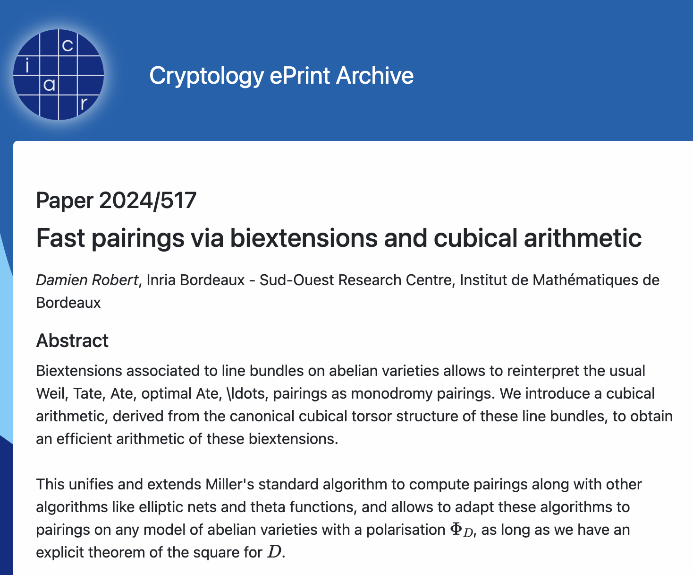

# MonoDOOM

For KalmarCTF 2025 I authored two challenges - one quite hard and one almost unintentionally easy. This blogpost covers the hard one - MonoDOOM.

## The challenge
The challenge has the scary description

> I have to read Grothendieck's SGA to solve crypto challs now?!

which probably either peaks your interest or does the exact opposite based on your mathematical interests. Assuming the former, we can download the challenge files, and we are presented with the following: 

```python
from sage.all import *

FLAG = b"kalmar{???}"

#Formulae from https://www.hyperelliptic.org/EFD/g1p/auto-montgom-xz.html
#dbl-1987-m-3
def double(a24, P):
    # FOR WRITEUP (lack of space): bunch of additions/multiplications
    return (X3, Z3)

#dadd-1987-m-3
def diff_add(P, Q, PmQ):
    # FOR WRITEUP (lack of space): bunch of additions/multiplications
    return (X5, Z5)

def ladder(a24, P, n):
    # FOR WRITEUP (lack of space): Completely standard montgomery ladder
    return P1

def keygen(A, G, ord_G):
    s = randint(1, ord_G)
    a24 = (A + 2)/4
    P = ladder(a24, G, s)
    return s, P

def derive_secret(A, Pub, sk):
    a24 = (A + 2)/4
    R = ladder(a24, Pub, sk)
    return int(R[0]/R[1])
```
Checking the link provided in the comment, we see that it leads to to formulae for XZ-coordinates on montgomery curves. This is a standard thing in ECC - It means that for the montgomery curve
$$
E_A : y^2 = x^3 + Ax^2 + x,
$$
a point $P = (x,y)$ is represented by the tuple $(X, Z)$, where $x = X/Z$ (formally, this is often referred to as working on the "Kummer line" $E/\pm 1 \simeq \mathbb{P}^1$).
Forgetting about formalities, we can anyway verify that the double and diff_add functions are seemingly standard, and correctly implemented.

For the rest of the code, we see
```python
if __name__=="__main__":
    p = 340824640#.... many more digits
    F = GF(p)
    A = F(28526181#.... many more digits
    ord_G = 42603080062#... many more digits

    G = (F(2024), F(1))

    s_A, p_A = keygen(A, G, ord_G)
    print(f"Alice sending Bob...\n{p_A}")

    s_B, p_B = keygen(A, G, ord_G)
    print(f"Bob sending Alice...\n{p_B}")

    ss_A = derive_secret(A, p_B, s_A)
    ss_B = derive_secret(A, p_A, s_B)

    assert ss_A == ss_B

    def encrypt_flag(shared_secret):
        #AES-CBC encrypt the flag
        return iv.hex(), ciphertext.hex()

    print(encrypt_flag(ss_A))
```
Although the curve and prime looks non-standard, this otherwise looks extremely not suspicious so far. We can take a look at the output, and see

```
Alice sending Bob...
(209857742520608467581271396064802876586374921499872855371645, 121663501921569046032156869406289097745191007032095282690267)
Bob sending Alice...
(333277706664672606095099199605163281441405663102971131524642, 74290998611431480800763772198569850611128494340151848588434)
('46abd1dcd085b93d15340b1666532029', '3559d472d94b64a5a9c0638858a9d7248d5d480c28dc26c07528295a5197a58288f12bab27d6f1d1c22f6933279e50274c59db965c2e97ca4155308ad10261e23f9eedcaa9cd0a27ca70625990c9ffb59dca7ecaf5a5f28ee2be0432ea61f581')
```
And here we realise possibly the first suspicious thing: Since the curve was using XZ-coordinates, these values sent are not your typical (x, y)-coordinates, but rather they represent the x-value X/Z. The fact that we get both X and Z is suspicious, but surely cannot be enough??

Googling a bit for papers on projective coordinate leaks, might lead to this classical attack by [Naccache, Smart and Stern](https://link.springer.com/chapter/10.1007/978-3-540-24676-3_16)

However, it quickly becomes clear that this attack is only enough to recover a few bits of the secret scalar...

## The misc part of the challenge
At this point, it will be an advantage to show some street-smartness (sorry to everyone who hates these "guessy" parts). Indeed, the prime and curve seems non-standard, and the generator used is suspiciously of the form
```python
G = (F(2024), F(1))
```
Now, remember, this is again XZ-coordinates. What happens if we compute the corresponding y-coordinate? Well, there are (most likely) two of them, and using sage, we can compute the two possible lifts of $G$ as
$$G = (2024, \pm517)$$
Now 517 is an extremely suspiciously number in this case, and is clearly meant as a hint. Guessing that this maybe refers to a paper, we check out the eprint:



Although this at first glance seems to be a paper about computing pairings which seems quite far from what we need, it does say that 

> Reinterparate the usual Weil, etc. as monodromy pairings

Could this be related to the name of the challenge?! If we keep reading, and make it all the way to page 4, the first references to Grothendieck SGA7 starts ticking in, and we should be convinced that this paper is relevant to the challenge. If we keep reading, we find at page 7 under "1.5 applications"

> ... some further applications: ..., ..., ..., and a novel side channel attack which I call the monodromy leak.

Could this be it? Jumping over 70 pages, to section 6.4 it quickly becomes clear that this attack is exactly what we want (and honestly sounds almost too good to be true)! Following some of the references, we see that Damien (the author) has even implemented the attack, so we follow that link https://gitlab.inria.fr/roberdam/kummer-line.

## The attack
Honestly, the attack uses so much cool, but also involved theory, that I cannot really say I understand it fully. I'll give my understanding of the attack (although it is really not doing it justice!). If you are only interested in seeing the final script to win, you can skip this section.

There are five main things to understand:
* There exists a notion of a "cubical point" $\tilde{P}$. The exact definition of a cubical point is ***mumbles something incomprehensible about line bundles***, but we can think of it as a point $P \in E$, and some "extra data". If we are given $P$ in projective coordinates $P = (X : Y : Z)$, we know that this is understood up to simultanious multiplication by a non-zero element, i.e. the tuple $(\lambda X : \lambda Y : \lambda Z)$ really defines the same point for $\lambda \neq 0$. And as it turns out, one way to represent this "extra data" in $\tilde{P}$ is precisly by **choice** of such projective coordinates. This will be called the "affine representation of the cubical point" from now on.

* Cubical points don't have a typical arithmetic defined to them, i.e. we can't senisbly define $\tilde{P} + \tilde{Q}$. However, one can define something called "cubical arithmetic", and it turns out that doubling and differential addition are special cases of cubical arithmetic.

* The formula for cubical doubling when using the affine representation coincides with the usual Montgomery doubling, and the formula for differential addition *almost* coincides.

* Assume we have two distinct cubical points (on the kummer line!) in affine representation $\tilde{P} = (X, Z)$ and $\widehat{P} = (\lambda X, \lambda Z)$.
Then if $[m]\tilde{P} = (X', Z')$ (where the scalar multiplication comes from cubical arithmetic!), we also have $[m]\widehat{P} = (\lambda^{(m^2)} X', \lambda^{(m^2)} Z')$

* Let $\ell$ be the order of $P$. In this particular case, where $\ell$ is coprime to $p-1$, we have a unique choice of cubical point $\widehat{P}$ "which is still of $\ell$-torsion", meaning that $[\ell]\widehat{P} = \tilde{0}$ for some fixed cubical point $\tilde{0}$ above the neutral element on $E$ (in general, $[\ell]\tilde{P}$ will be a cubical point above $0$, but not necessarily the cubical point $\tilde{0}$). Further, this point is easy to compute.

Pretending for a sec that the formulae for differential addtiion really coincides, we can already describe the attack quite easily: In this case the ladder really computes the cubical scalar multiplication $[m]\tilde{G}$, thus we can assume that we are given $\tilde{G}, [m]\tilde{G}$. This gives the following approach to solve:

* Compute the canonical cubical point of $\ell$-torsion $\widehat{G}$. Compute $\lambda = Z(\tilde{G})/Z(\widehat{G}) = 1/Z(\widehat{G})$.
* Similarily, compute the canonical $\widehat{[m]G}$, and $\lambda' = Z([m]\tilde{G})/Z(\widehat{[m]G})$
* By the above discussion, recover $m^2$ as the discrete log of $\lambda'$ to the base $\lambda$ (this is now a discrete log in $\mathbb{F}_p$ instead, which is way easier than on the curve of course!), and then $m$ is one square roots mod $p-1$ of this value.

Now the last point is that this attack only worked if the differential addition coincides, which it does not. Luckily, Damien has already solved this part for us, and shown how the attack then essentially still reduces to a few dlps in $\mathbb{F}_p$, and solving a quadratic equation modulo $p-1$, assuming we know the bit-length of $m$.

## Full Solve Script
In fact, there is not that much adapting we need to do to Damien's original script to get it to work on our instance. Factoring $p-1$ gives
```python
p - 1 = 2 * 37 * 7793729 * 12033323 * 13421363 * 13580981 * 19281649 * 19285337 * 24502909 * 29570017
```
which certainly looks like something its easy to solve dlp's in. Adapting Damien's script to search through all the possible solutions, for all the possible bit lengths of $m$, we get the final solve script:

```python
from sage.all import *
from chal import ladder, double, derive_secret
import itertools

# this is the correct differential addition from the cubical torsor point of view
def cubical_diff_add(P, Q, PmQ):
    XP, ZP = P
    XQ, ZQ = Q
    XPmQ, ZPmQ = PmQ
    a=XP+ZP
    b=XP-ZP
    c=XQ+ZQ
    d=XQ-ZQ
    da = d*a
    cb = c*b
    dapcb = da+cb
    damcb = da-cb
    XPQ=dapcb*dapcb / XPmQ
    ZPQ=damcb*damcb / ZPmQ
    return (XPQ/4, ZPQ/4)

# the cubical ladder will be used to compute our canonical lift
def cubical_ladder(A24, P, n):
    n = abs(n)
    P1, P2 = (1, 0), P
    if n == 0:
        return P1, P2
    for bit in bin(n)[2:]:
        Q = cubical_diff_add(P2, P1, P)
        if bit == "1":
            P2 = double(A24, P2)
            P1 = Q
        else:
            P1 = double(A24, P1)
            P2 = Q
    return P1

def ratio(P, Q):
    XP, ZP = P
    XQ, ZQ = Q
    if XP == 0:
        assert XQ == 0
        return (ZQ/ZP)
    else:
        l=XQ/XP
        assert (ZQ == l*ZP)
        return l

def monodromy_atk(F, ordG, A, G, P):

    for l in range(195, 1, -1):
        print(f"Trying bitlength l = {l}")
        p = F.characteristic()
        A24=(A+2)/4

        xG = G[0]

        u = crt([0,1], [p-1, ordG])
        Gthilde = cubical_ladder(A24, G, u) # "Canonical lift"
        Pthilde = cubical_ladder(A24, P, u) # "Canonical lift"

        l1 = ratio(Gthilde, G)
        l2 = ratio(Pthilde, P)

        zeta = F.multiplicative_generator()
        print("Solving dlogs")
        print(factor(p-1))
        #dlp_x = Mod((4*xG).log(zeta),p-1)
        dlp_x = (4*xG).log(zeta)
        print("Done")
        dlp_l2 = Mod(l2.log(zeta),p-1)
        print("Done")
        dlp_l1 = Mod(l1.log(zeta),p-1)
        print("Done")

        #assert dlp_x*m*(2**l-m)+dlp_l1*m**2 == dlp_l2

        crt_mods = []
        crt_ins = []

        wrong_bitlen = False
        for ell, e in factor(p-1):
            print(f"Doing factor: {ell, e}")
            #if ell == 2: #Skip 2 because annoying
            #    continue
            R = Integers(ell**e)["X"]
            X=R.gen()
            
            f = X**2*(dlp_l1-dlp_x)+2**l*dlp_x*X - dlp_l2
            #print(ell, e)
            #print(dlp_l1, dlp_x, dlp_l2)
            if f.degree() == -1:
                crt_ins.append([Integer(a) for a in range(ell**e)])
            else:
                rts = [Integer(r) for r in f.roots(multiplicities=False)]
                if len(rts) == 0:
                    wrong_bitlen = True
                    continue
                assert len(rts) > 0
                crt_ins.append(rts)
            crt_mods.append(ell**e)

        if wrong_bitlen:
            continue
        
        for comb in itertools.product(*crt_ins):
            try:
                rec_m = crt(list(comb), crt_mods)
            except:
                break
            print(rec_m)
            rec_P = ladder(A24, G, rec_m)
            if rec_P[0]/rec_P[1] == P[0]/P[1]:
                print("FOUND!!!")
                return rec_m
        
    assert False, "Didnt work :c"

p = 340824640496360275329125187555879171429601544029719477817787
F = GF(p)
A = F(285261811835788437932082156343256480312664037202203048186662)
            
G = (F(2024), F(1))
ord_G = 42603080062045034416140648444405950943345472415479119301079

from ast import literal_eval

with open("output.txt", "r") as f:
    f.readline()
    p_A = [F(c) for c in literal_eval(f.readline())]
    f.readline()
    p_B = [F(c) for c in literal_eval(f.readline())]
    iv, ct = literal_eval(f.readline())

print(p_A)
s_A = monodromy_atk(F, ord_G, A, G, p_A)

ss = derive_secret(A, p_B, s_A)

import hashlib
import os
from Crypto.Cipher import AES
from Crypto.Util.Padding import pad, unpad

sha1 = hashlib.sha1()
sha1.update(str(ss).encode('ascii'))
key = sha1.digest()[:16]
cipher = AES.new(key, AES.MODE_CBC, bytes.fromhex(iv))
print(unpad(cipher.decrypt(bytes.fromhex(ct)), 16))
```

which finds in a few seconds

```
kalmar{M0r3_m0nodr0mi3s_at_https://web.archive.org/web/20100418003820/http://monodromy.com:80/}
```

The flags points to the amazing (webarchived) website that Wouter Castryck showed me:


which in addition to being hilarious has some good sources for further reading too!